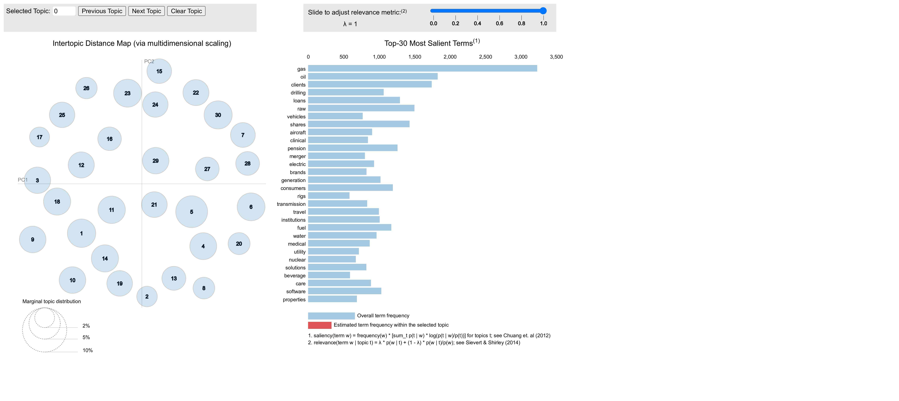

This is the online appendix accompanying "When Methods Matter: How Implementation Choices Shape Topic Discovery in Financial Text"

# Requirements

Python: Version ≥ 3.9 is required.

Mallet: A Java-based topic modeling tool, as lda_eval_lib includes a wrapper for Mallet.

To install Mallet, follow the detailed instructions provided at https://programminghistorian.org/en/lessons/topic-modeling-and-mallet

# How to use


```python
import lda_eval_lib
import pandas as pd
import os
```


```python
# Load a test file
package_path = os.path.dirname(lda_eval_lib.__file__)
data_path = os.path.join(package_path, 'test_text.pkl')
item1a = pd.read_pickle(data_path)
tokenized_text = item1a['text4LDA']
```

### LDA run (gensim LDA and modified mallet wrapper)


```python
# Set parameters
minpc = 0.05 
maxpc = 0.5
alpha = "auto"
beta = "auto"
ntopics = 30

# folder to save model and data files
savefolder = '/Users/Downloads'

# path to mallet bin
mallet_path = '/Users/mallet-2.0.8/bin/mallet'
```


```python
lda_eval_lib.lda_model.lda_run(tokenized_text, minpc, maxpc, alpha, beta, ntopics, mallet_path, savefolder, gensimpasses = 3, gensimiterations = 3, malletiterations = 100)
```

     - modelling  gensim_0.05_0.5_30_auto_auto
    model saved: /Users/Downloads/gensim_0.05_0.5_30_auto_auto
     - modelling  mallet_0.05_0.5_30_auto_auto
    model saved: /Users/Downloads/mallet_0.05_0.5_30_auto_auto


```python
# Load a trained model 
model_path = "/Users/Downloads/mallet_0.05_0.5_30_0.05_0.01"
lda_model, textbeforetokenization, tokenized_text, corpus, id2word = lda_eval_lib.util.load_lda_run(model_path)

# lda_model is other gensim.lda object or gensim.mallet object
lda_model.show_topics(num_topics=-1)
```


    [(0,
      '0.018*"raw" + 0.016*"project" + 0.011*"patents" + 0.010*"venture" + 0.008*"hazardous" + 0.007*"sites" + 0.007*"commodity" + 0.006*"execution" + 0.006*"default" + 0.005*"patent"'),
     (1,
      '0.024*"healthcare" + 0.010*"patents" + 0.010*"agreement" + 0.009*"manufacture" + 0.009*"separation" + 0.008*"patent" + 0.007*"raw" + 0.007*"licenses" + 0.007*"stockholders" + 0.006*"audits"'),
     (2,
      '0.023*"cards" + 0.019*"card" + 0.015*"members" + 0.013*"member" + 0.013*"advertising" + 0.011*"brand" + 0.010*"acceptance" + 0.010*"stations" + 0.009*"travel" + 0.007*"regulators"'),
     (3,
      '0.028*"brands" + 0.020*"water" + 0.019*"consumers" + 0.016*"raw" + 0.013*"beverage" + 0.012*"class" + 0.011*"glass" + 0.011*"retailers" + 0.010*"consumption" + 0.009*"distributors"'),
     (4,
      '0.021*"care" + 0.011*"deterioration" + 0.010*"currencies" + 0.009*"licensing" + 0.008*"medical" + 0.008*"protected" + 0.008*"patient" + 0.007*"interpretations" + 0.006*"taxation" + 0.006*"manufacture"'),
     (5,
      '0.028*"gas" + 0.025*"generation" + 0.023*"electric" + 0.022*"utility" + 0.018*"nuclear" + 0.015*"prospects" + 0.013*"fuel" + 0.013*"transmission" + 0.012*"renewable" + 0.012*"electricity"'),
     (6,
      '0.038*"institutions" + 0.026*"institution" + 0.022*"participate" + 0.020*"title" + 0.019*"iv" + 0.016*"eligibility" + 0.014*"education" + 0.010*"medical" + 0.010*"lose" + 0.010*"aid"'),
     (7,
      '0.017*"yen" + 0.016*"denominated" + 0.012*"instruments" + 0.012*"rating" + 0.010*"derivatives" + 0.009*"derivative" + 0.009*"brand" + 0.008*"premium" + 0.008*"stockholders" + 0.008*"hedging"'),
     (8,
      '0.077*"oil" + 0.069*"gas" + 0.052*"drilling" + 0.028*"rigs" + 0.021*"reserves" + 0.015*"exploration" + 0.013*"crude" + 0.010*"commodity" + 0.010*"offshore" + 0.009*"water"'),
     (9,
      '0.011*"goods" + 0.010*"supplier" + 0.008*"locations" + 0.008*"located" + 0.007*"base" + 0.007*"skilled" + 0.007*"component" + 0.007*"parts" + 0.007*"trading" + 0.007*"resolution"'),
     (10,
      '0.032*"clinical" + 0.021*"medical" + 0.021*"approval" + 0.017*"manufacturers" + 0.016*"devices" + 0.016*"trials" + 0.014*"reimbursement" + 0.013*"drug" + 0.012*"patients" + 0.012*"approved"'),
     (11,
      '0.023*"segment" + 0.016*"note" + 0.014*"dealers" + 0.013*"fair" + 0.012*"compared" + 0.012*"unit" + 0.012*"partially" + 0.011*"pension" + 0.011*"continuing" + 0.011*"recognized"'),
     (12,
      '0.019*"raw" + 0.012*"research" + 0.009*"manufacture" + 0.007*"acceptance" + 0.007*"incidents" + 0.007*"improper" + 0.006*"emerging" + 0.006*"parts" + 0.006*"industrial" + 0.006*"imports"'),
     (13,
      '0.009*"disaster" + 0.006*"quickly" + 0.006*"regulators" + 0.006*"fees" + 0.005*"currencies" + 0.005*"continuity" + 0.005*"country" + 0.005*"properly" + 0.005*"profit" + 0.004*"efficient"'),
     (14,
      '0.045*"loans" + 0.026*"loan" + 0.015*"banking" + 0.015*"real" + 0.015*"bank" + 0.014*"estate" + 0.012*"banks" + 0.012*"collateral" + 0.011*"mortgage" + 0.010*"allowance"'),
     (15,
      '0.035*"software" + 0.016*"solutions" + 0.010*"cloud" + 0.010*"distributors" + 0.007*"licenses" + 0.007*"technical" + 0.007*"incident" + 0.006*"license" + 0.006*"transformation" + 0.006*"consuming"'),
     (16,
      '0.017*"opinion" + 0.017*"taxable" + 0.016*"representations" + 0.014*"merger" + 0.014*"ruling" + 0.012*"distributions" + 0.012*"qualify" + 0.011*"separation" + 0.011*"counsel" + 0.011*"free"'),
     (17,
      '0.037*"properties" + 0.013*"libor" + 0.013*"real" + 0.013*"shares" + 0.012*"lease" + 0.008*"estate" + 0.008*"leases" + 0.007*"executive" + 0.006*"shareholders" + 0.006*"distributions"'),
     (18,
      '0.118*"clients" + 0.039*"client" + 0.019*"solutions" + 0.013*"stockholders" + 0.009*"underwriting" + 0.009*"brokerage" + 0.008*"consulting" + 0.008*"firms" + 0.007*"complete" + 0.007*"publicity"'),
     (19,
      '0.013*"holders" + 0.012*"ii" + 0.011*"directors" + 0.010*"licenses" + 0.010*"covenants" + 0.009*"forum" + 0.009*"assure" + 0.008*"class" + 0.008*"lose" + 0.007*"amended"'),
     (20,
      '0.021*"fuel" + 0.011*"transmission" + 0.010*"digital" + 0.009*"structures" + 0.009*"water" + 0.009*"gas" + 0.009*"coal" + 0.009*"grade" + 0.008*"ways" + 0.008*"respective"'),
     (21,
      '0.011*"care" + 0.009*"clearance" + 0.009*"clinical" + 0.007*"clearances" + 0.007*"monetary" + 0.006*"reimbursement" + 0.006*"collaborative" + 0.005*"ventures" + 0.005*"indemnification" + 0.005*"relationship"'),
     (22,
      '0.047*"shares" + 0.019*"shareholders" + 0.013*"preferred" + 0.013*"termination" + 0.008*"ordinary" + 0.008*"series" + 0.007*"conversion" + 0.007*"principal" + 0.007*"early" + 0.006*"lenders"'),
     (23,
      '0.056*"gas" + 0.025*"generation" + 0.024*"electric" + 0.022*"transmission" + 0.019*"nuclear" + 0.015*"electricity" + 0.015*"consumers" + 0.014*"utility" + 0.011*"plants" + 0.011*"recover"'),
     (24,
      '0.030*"libor" + 0.021*"institutions" + 0.016*"deposits" + 0.009*"fraud" + 0.008*"regulators" + 0.008*"instruments" + 0.008*"confidence" + 0.007*"benchmark" + 0.007*"bank" + 0.007*"counterparties"'),
     (25,
      '0.051*"vehicles" + 0.029*"vehicle" + 0.021*"rental" + 0.018*"fleet" + 0.013*"locations" + 0.009*"truck" + 0.008*"operators" + 0.008*"manufacturers" + 0.008*"fuel" + 0.008*"travel"'),
     (26,
      '0.014*"subcontractors" + 0.014*"profits" + 0.012*"suspension" + 0.012*"aircraft" + 0.011*"backlog" + 0.011*"budget" + 0.010*"contractors" + 0.010*"defense" + 0.009*"segment" + 0.009*"procurement"'),
     (27,
      '0.029*"packaging" + 0.022*"beverage" + 0.018*"consumers" + 0.016*"brands" + 0.015*"ingredients" + 0.010*"publicity" + 0.009*"aluminum" + 0.009*"containers" + 0.009*"retail" + 0.009*"image"'),
     (28,
      '0.048*"aircraft" + 0.028*"travel" + 0.026*"air" + 0.024*"fuel" + 0.023*"airline" + 0.023*"carriers" + 0.019*"airlines" + 0.009*"agreement" + 0.009*"traffic" + 0.007*"fees"'),
     (29,
      '0.031*"pension" + 0.021*"merger" + 0.011*"deferred" + 0.010*"steel" + 0.010*"contributions" + 0.009*"integration" + 0.009*"completion" + 0.009*"defined" + 0.008*"completed" + 0.008*"complete"')]


### model evaluation


```python
model_path = "/Users/Downloads/mallet_0.05_0.5_30_0.05_0.01"

print(f"LDA model loaded from: {model_path}")

a=lda_eval_lib.metrics.IDXtopics2keep(model_path)
print(f"proportion of valid topics: {a}")

b=lda_eval_lib.metrics.diversity(model_path)
print(f"diversity score: {b}")

c=lda_eval_lib.metrics.granularity(model_path)
print(f"granularity score: {c}")

d=lda_eval_lib.metrics.perplexity(model_path)
print(f"perplexity score: {d}")

e=lda_eval_lib.metrics.coherence(model_path)
print(f"coherence score: {e}")
```

    LDA model loaded from: /Users/Downloads/mallet_0.05_0.5_30_0.05_0.01
    proportion of valid topics: 1.0
    diversity score: 0.7733333333333333
    granularity score: 0.6966666666666667
    perplexity score: -7.350240838543099
    coherence score: 0.5497179415067865


### GPT assisted tasks (WIT, labelling)


```python
# ChatGPT assisted tasks 
client = lda_eval_lib.util.OpenAI_client()
```

    Enter your API key:  ········


```python
top_n = 5
bottom_n = 0.15
common_n = 20
chunk_size = 3

# Define the model
gpt_model = "gpt-4o"
model_path = "/Users/Downloads/mallet_0.05_0.5_30_0.05_0.01"

WIT = lda_eval_lib.gpt_wit.word_intrusion_task(model_path, client, top_n, bottom_n, common_n, chunk_size=10,
                           gpt_model="gpt-4o", temperature=0)

```


```python
WIT.iloc[0]['task']
```


<div>
<style scoped>
    .dataframe tbody tr th:only-of-type {
        vertical-align: middle;
    }

    .dataframe tbody tr th {
        vertical-align: top;
    }

    .dataframe thead th {
        text-align: right;
    }
</style>
<table border="1" class="dataframe">
  <thead>
    <tr style="text-align: right;">
      <th></th>
      <th>Model</th>
      <th>Topic</th>
      <th>Word0</th>
      <th>Word1</th>
      <th>Word2</th>
      <th>Word3</th>
      <th>Word4</th>
      <th>Intruder</th>
      <th>Response</th>
    </tr>
  </thead>
  <tbody>
    <tr>
      <th>0</th>
      <td>mallet_0.05_0.5_30_0.05_0.01</td>
      <td>0</td>
      <td>raw</td>
      <td>project</td>
      <td>patents</td>
      <td>venture</td>
      <td>hazardous</td>
      <td>monetary</td>
      <td>hazardous</td>
    </tr>
    <tr>
      <th>1</th>
      <td>mallet_0.05_0.5_30_0.05_0.01</td>
      <td>1</td>
      <td>healthcare</td>
      <td>patents</td>
      <td>agreement</td>
      <td>manufacture</td>
      <td>separation</td>
      <td>expansion</td>
      <td>healthcare</td>
    </tr>
    <tr>
      <th>2</th>
      <td>mallet_0.05_0.5_30_0.05_0.01</td>
      <td>2</td>
      <td>cards</td>
      <td>card</td>
      <td>members</td>
      <td>member</td>
      <td>advertising</td>
      <td>lending</td>
      <td>lending</td>
    </tr>
    <tr>
      <th>3</th>
      <td>mallet_0.05_0.5_30_0.05_0.01</td>
      <td>3</td>
      <td>brands</td>
      <td>water</td>
      <td>consumers</td>
      <td>raw</td>
      <td>beverage</td>
      <td>senior</td>
      <td>senior</td>
    </tr>
    <tr>
      <th>4</th>
      <td>mallet_0.05_0.5_30_0.05_0.01</td>
      <td>4</td>
      <td>care</td>
      <td>deterioration</td>
      <td>currencies</td>
      <td>licensing</td>
      <td>medical</td>
      <td>outcomes</td>
      <td>currencies</td>
    </tr>
    <tr>
      <th>5</th>
      <td>mallet_0.05_0.5_30_0.05_0.01</td>
      <td>5</td>
      <td>gas</td>
      <td>generation</td>
      <td>electric</td>
      <td>utility</td>
      <td>nuclear</td>
      <td>strength</td>
      <td>strength</td>
    </tr>
    <tr>
      <th>6</th>
      <td>mallet_0.05_0.5_30_0.05_0.01</td>
      <td>6</td>
      <td>institutions</td>
      <td>institution</td>
      <td>participate</td>
      <td>title</td>
      <td>iv</td>
      <td>properly</td>
      <td>iv</td>
    </tr>
    <tr>
      <th>7</th>
      <td>mallet_0.05_0.5_30_0.05_0.01</td>
      <td>7</td>
      <td>yen</td>
      <td>denominated</td>
      <td>instruments</td>
      <td>rating</td>
      <td>derivatives</td>
      <td>prospective</td>
      <td>prospective</td>
    </tr>
    <tr>
      <th>8</th>
      <td>mallet_0.05_0.5_30_0.05_0.01</td>
      <td>8</td>
      <td>oil</td>
      <td>gas</td>
      <td>drilling</td>
      <td>rigs</td>
      <td>reserves</td>
      <td>partially</td>
      <td>partially</td>
    </tr>
    <tr>
      <th>9</th>
      <td>mallet_0.05_0.5_30_0.05_0.01</td>
      <td>9</td>
      <td>goods</td>
      <td>supplier</td>
      <td>locations</td>
      <td>located</td>
      <td>base</td>
      <td>residential</td>
      <td>residential</td>
    </tr>
    <tr>
      <th>10</th>
      <td>mallet_0.05_0.5_30_0.05_0.01</td>
      <td>10</td>
      <td>clinical</td>
      <td>medical</td>
      <td>approval</td>
      <td>manufacturers</td>
      <td>devices</td>
      <td>deterioration</td>
      <td>deterioration</td>
    </tr>
    <tr>
      <th>11</th>
      <td>mallet_0.05_0.5_30_0.05_0.01</td>
      <td>11</td>
      <td>segment</td>
      <td>note</td>
      <td>dealers</td>
      <td>fair</td>
      <td>compared</td>
      <td>currencies</td>
      <td>segment</td>
    </tr>
    <tr>
      <th>12</th>
      <td>mallet_0.05_0.5_30_0.05_0.01</td>
      <td>12</td>
      <td>raw</td>
      <td>research</td>
      <td>manufacture</td>
      <td>acceptance</td>
      <td>incidents</td>
      <td>enterprises</td>
      <td>incidents</td>
    </tr>
    <tr>
      <th>13</th>
      <td>mallet_0.05_0.5_30_0.05_0.01</td>
      <td>13</td>
      <td>disaster</td>
      <td>quickly</td>
      <td>fees</td>
      <td>regulators</td>
      <td>currencies</td>
      <td>design</td>
      <td>disaster</td>
    </tr>
    <tr>
      <th>14</th>
      <td>mallet_0.05_0.5_30_0.05_0.01</td>
      <td>14</td>
      <td>loans</td>
      <td>loan</td>
      <td>banking</td>
      <td>real</td>
      <td>bank</td>
      <td>brands</td>
      <td>brands</td>
    </tr>
    <tr>
      <th>15</th>
      <td>mallet_0.05_0.5_30_0.05_0.01</td>
      <td>15</td>
      <td>software</td>
      <td>solutions</td>
      <td>cloud</td>
      <td>distributors</td>
      <td>licenses</td>
      <td>treatment</td>
      <td>treatment</td>
    </tr>
    <tr>
      <th>16</th>
      <td>mallet_0.05_0.5_30_0.05_0.01</td>
      <td>16</td>
      <td>opinion</td>
      <td>taxable</td>
      <td>representations</td>
      <td>merger</td>
      <td>ruling</td>
      <td>yen</td>
      <td>yen</td>
    </tr>
    <tr>
      <th>17</th>
      <td>mallet_0.05_0.5_30_0.05_0.01</td>
      <td>17</td>
      <td>properties</td>
      <td>libor</td>
      <td>real</td>
      <td>shares</td>
      <td>lease</td>
      <td>developers</td>
      <td>libor</td>
    </tr>
    <tr>
      <th>18</th>
      <td>mallet_0.05_0.5_30_0.05_0.01</td>
      <td>18</td>
      <td>clients</td>
      <td>client</td>
      <td>solutions</td>
      <td>stockholders</td>
      <td>underwriting</td>
      <td>protected</td>
      <td>underwriting</td>
    </tr>
    <tr>
      <th>19</th>
      <td>mallet_0.05_0.5_30_0.05_0.01</td>
      <td>19</td>
      <td>holders</td>
      <td>ii</td>
      <td>directors</td>
      <td>licenses</td>
      <td>covenants</td>
      <td>brands</td>
      <td>brands</td>
    </tr>
    <tr>
      <th>20</th>
      <td>mallet_0.05_0.5_30_0.05_0.01</td>
      <td>20</td>
      <td>fuel</td>
      <td>transmission</td>
      <td>digital</td>
      <td>structures</td>
      <td>water</td>
      <td>pension</td>
      <td>digital</td>
    </tr>
    <tr>
      <th>21</th>
      <td>mallet_0.05_0.5_30_0.05_0.01</td>
      <td>21</td>
      <td>care</td>
      <td>clearance</td>
      <td>clinical</td>
      <td>clearances</td>
      <td>monetary</td>
      <td>trading</td>
      <td>clinical</td>
    </tr>
    <tr>
      <th>22</th>
      <td>mallet_0.05_0.5_30_0.05_0.01</td>
      <td>22</td>
      <td>shares</td>
      <td>shareholders</td>
      <td>preferred</td>
      <td>termination</td>
      <td>ordinary</td>
      <td>awards</td>
      <td>termination</td>
    </tr>
    <tr>
      <th>23</th>
      <td>mallet_0.05_0.5_30_0.05_0.01</td>
      <td>23</td>
      <td>gas</td>
      <td>generation</td>
      <td>electric</td>
      <td>transmission</td>
      <td>nuclear</td>
      <td>iii</td>
      <td>iii</td>
    </tr>
    <tr>
      <th>24</th>
      <td>mallet_0.05_0.5_30_0.05_0.01</td>
      <td>24</td>
      <td>libor</td>
      <td>institutions</td>
      <td>deposits</td>
      <td>fraud</td>
      <td>regulators</td>
      <td>pending</td>
      <td>pending</td>
    </tr>
    <tr>
      <th>25</th>
      <td>mallet_0.05_0.5_30_0.05_0.01</td>
      <td>25</td>
      <td>vehicles</td>
      <td>vehicle</td>
      <td>rental</td>
      <td>fleet</td>
      <td>locations</td>
      <td>procurement</td>
      <td>procurement</td>
    </tr>
    <tr>
      <th>26</th>
      <td>mallet_0.05_0.5_30_0.05_0.01</td>
      <td>26</td>
      <td>subcontractors</td>
      <td>profits</td>
      <td>suspension</td>
      <td>aircraft</td>
      <td>backlog</td>
      <td>contributions</td>
      <td>suspension</td>
    </tr>
    <tr>
      <th>27</th>
      <td>mallet_0.05_0.5_30_0.05_0.01</td>
      <td>27</td>
      <td>packaging</td>
      <td>beverage</td>
      <td>consumers</td>
      <td>brands</td>
      <td>ingredients</td>
      <td>models</td>
      <td>models</td>
    </tr>
    <tr>
      <th>28</th>
      <td>mallet_0.05_0.5_30_0.05_0.01</td>
      <td>28</td>
      <td>aircraft</td>
      <td>travel</td>
      <td>air</td>
      <td>fuel</td>
      <td>airline</td>
      <td>device</td>
      <td>device</td>
    </tr>
    <tr>
      <th>29</th>
      <td>mallet_0.05_0.5_30_0.05_0.01</td>
      <td>29</td>
      <td>pension</td>
      <td>merger</td>
      <td>deferred</td>
      <td>steel</td>
      <td>contributions</td>
      <td>participation</td>
      <td>steel</td>
    </tr>
  </tbody>
</table>
</div>


```python
gpt_model = "gpt-4o"
model_path = "/Users/Downloads/mallet_0.05_0.5_30_0.05_0.01"
lda_eval_lib.gpt_labelling.labelling(model_path, client, gpt_model)
```

    Labels checked - overlapping labels identified!
    Suggesting new labels...
    Done!


<div>
<style scoped>
    .dataframe tbody tr th:only-of-type {
        vertical-align: middle;
    }

    .dataframe tbody tr th {
        vertical-align: top;
    }

    .dataframe thead th {
        text-align: right;
    }
</style>
<table border="1" class="dataframe">
  <thead>
    <tr style="text-align: right;">
      <th></th>
      <th>topic</th>
      <th>label</th>
      <th>rationale</th>
      <th>keywords</th>
    </tr>
  </thead>
  <tbody>
    <tr>
      <th>0</th>
      <td>Topic0</td>
      <td>Procurement and Project Execution Risks</td>
      <td>Emphasizes risks linked with obtaining and han...</td>
      <td>raw, project, patents, venture, hazardous, sit...</td>
    </tr>
    <tr>
      <th>1</th>
      <td>Topic1</td>
      <td>Healthcare Production and Patenting Risk</td>
      <td>Centers on risks related to manufacturing and ...</td>
      <td>healthcare, patents, agreement, manufacture, s...</td>
    </tr>
    <tr>
      <th>2</th>
      <td>Topic2</td>
      <td>Consumer Payment Systems and Marketing Risks</td>
      <td>The keywords emphasize 'cards', 'card members'...</td>
      <td>cards, card, members, member, advertising, bra...</td>
    </tr>
    <tr>
      <th>3</th>
      <td>Topic3</td>
      <td>Beverage Industry Supply Chain and Consumer Risks</td>
      <td>The keywords highlight the beverage industry w...</td>
      <td>brands, water, consumers, raw, beverage, class...</td>
    </tr>
    <tr>
      <th>4</th>
      <td>Topic4</td>
      <td>Medical Compliance and Currency Risk</td>
      <td>Combines risks related to medical compliance a...</td>
      <td>care, deterioration, currencies, licensing, me...</td>
    </tr>
    <tr>
      <th>5</th>
      <td>Topic5</td>
      <td>Renewable Energy Development Risks</td>
      <td>Focuses on risks linked to the development of ...</td>
      <td>gas, generation, electric, utility, nuclear, p...</td>
    </tr>
    <tr>
      <th>6</th>
      <td>Topic6</td>
      <td>Educational Institution Participation and Fund...</td>
      <td>The keywords indicate risks related to educati...</td>
      <td>institutions, institution, participate, title,...</td>
    </tr>
    <tr>
      <th>7</th>
      <td>Topic7</td>
      <td>Derivative and Hedging Strategy Risks</td>
      <td>Emphasizes risks related to the management of ...</td>
      <td>yen, denominated, instruments, rating, derivat...</td>
    </tr>
    <tr>
      <th>8</th>
      <td>Topic8</td>
      <td>Crude Oil and Gas Extraction Risks</td>
      <td>Centers around risks linked to the extraction ...</td>
      <td>oil, gas, drilling, rigs, reserves, exploratio...</td>
    </tr>
    <tr>
      <th>9</th>
      <td>Topic9</td>
      <td>Component Sourcing and Logistics Vulnerability</td>
      <td>Highlights risks arising from sourcing compone...</td>
      <td>goods, supplier, locations, located, base, ski...</td>
    </tr>
    <tr>
      <th>10</th>
      <td>Topic10</td>
      <td>Medicine and Device Approval Challenges</td>
      <td>Focuses on risks linked to gaining approval fo...</td>
      <td>clinical, medical, approval, manufacturers, de...</td>
    </tr>
    <tr>
      <th>11</th>
      <td>Topic11</td>
      <td>Pension Accountability and Reporting Risks</td>
      <td>Stresses the risks connected to pension accoun...</td>
      <td>segment, note, dealers, fair, compared, unit, ...</td>
    </tr>
    <tr>
      <th>12</th>
      <td>Topic12</td>
      <td>Manufacturing Disruptions and Material Acceptance</td>
      <td>Focuses on risks related to the disruption in ...</td>
      <td>raw, research, manufacture, acceptance, incide...</td>
    </tr>
    <tr>
      <th>13</th>
      <td>Topic13</td>
      <td>Business Continuity and Currency Risks</td>
      <td>Keywords such as disaster, continuity, currenc...</td>
      <td>disaster, quickly, fees, regulators, currencie...</td>
    </tr>
    <tr>
      <th>14</th>
      <td>Topic14</td>
      <td>Real Estate Loan Management Risks</td>
      <td>Emphasizes risks associated with the managemen...</td>
      <td>loans, loan, banking, real, bank, estate, bank...</td>
    </tr>
    <tr>
      <th>15</th>
      <td>Topic15</td>
      <td>Software and Cloud Licensing Technicalities</td>
      <td>The keywords focus on software solutions, clou...</td>
      <td>software, solutions, cloud, distributors, lice...</td>
    </tr>
    <tr>
      <th>16</th>
      <td>Topic16</td>
      <td>Taxable Implications in Corporate Mergers</td>
      <td>This topic revolves around tax opinions, repre...</td>
      <td>opinion, taxable, representations, merger, rul...</td>
    </tr>
    <tr>
      <th>17</th>
      <td>Topic17</td>
      <td>Lease Agreement and Property Ownership Risks</td>
      <td>Focuses on risks related to real estate owners...</td>
      <td>properties, libor, real, shares, lease, estate...</td>
    </tr>
    <tr>
      <th>18</th>
      <td>Topic18</td>
      <td>Client Advisory and Brokerage Operations</td>
      <td>This set of keywords pertains to client relati...</td>
      <td>clients, client, solutions, stockholders, unde...</td>
    </tr>
    <tr>
      <th>19</th>
      <td>Topic19</td>
      <td>Corporate Legal Amendments and Governance Risks</td>
      <td>Highlights risks arising from corporate legal ...</td>
      <td>holders, ii, directors, licenses, covenants, f...</td>
    </tr>
    <tr>
      <th>20</th>
      <td>Topic20</td>
      <td>Logistic and Resource Management in Energy Pro...</td>
      <td>Focuses on risks related to resource and logis...</td>
      <td>fuel, transmission, digital, structures, water...</td>
    </tr>
    <tr>
      <th>21</th>
      <td>Topic21</td>
      <td>Healthcare Approval and Collaboration Risks</td>
      <td>Highlights risks connected with approvals and ...</td>
      <td>care, clearance, clinical, clearances, monetar...</td>
    </tr>
    <tr>
      <th>22</th>
      <td>Topic22</td>
      <td>Equity Financing and Ownership Risks</td>
      <td>Focuses on risks linked to shareholder interes...</td>
      <td>shares, shareholders, preferred, termination, ...</td>
    </tr>
    <tr>
      <th>23</th>
      <td>Topic23</td>
      <td>Energy Supply and Consumer Utility Risks</td>
      <td>Highlights risks associated with the supply of...</td>
      <td>gas, generation, electric, transmission, nucle...</td>
    </tr>
    <tr>
      <th>24</th>
      <td>Topic24</td>
      <td>Financial Integrity and Regulatory Standard Risks</td>
      <td>Centered around risks in financial markets rel...</td>
      <td>libor, institutions, deposits, fraud, regulato...</td>
    </tr>
    <tr>
      <th>25</th>
      <td>Topic25</td>
      <td>Vehicle and Fleet Management Risks</td>
      <td>The keywords focus on aspects related to vehic...</td>
      <td>vehicles, vehicle, rental, fleet, locations, t...</td>
    </tr>
    <tr>
      <th>26</th>
      <td>Topic26</td>
      <td>Subcontractor and Defense Contracting Risks</td>
      <td>Focuses on risks related to subcontractor mana...</td>
      <td>subcontractors, profits, suspension, aircraft,...</td>
    </tr>
    <tr>
      <th>27</th>
      <td>Topic27</td>
      <td>Consumer Goods Packaging and Brand Risks</td>
      <td>Keywords involve packaging, beverages, consume...</td>
      <td>packaging, beverage, consumers, brands, ingred...</td>
    </tr>
    <tr>
      <th>28</th>
      <td>Topic28</td>
      <td>Airline Industry Operational Risks</td>
      <td>The focus on aircraft, travel, fuel, carriers,...</td>
      <td>aircraft, travel, air, fuel, airline, carriers...</td>
    </tr>
    <tr>
      <th>29</th>
      <td>Topic29</td>
      <td>Merger Integration and Pension Management Risks</td>
      <td>Highlights risks linked to integration in corp...</td>
      <td>pension, merger, deferred, steel, contribution...</td>
    </tr>
  </tbody>
</table>
</div>


### Visualization


```python
import pyLDAvis

model_path = "/Users/Downloads/mallet_0.05_0.5_30_auto_auto"

pyldavisdata = lda_eval_lib.custom_pyvis.visualize_topics(model_path)

# Apply pyLDAvis
vis_data= pyLDAvis.prepare(**pyldavisdata, R=30, n_jobs = -1, mds='mmds', sort_topics=False)

```


